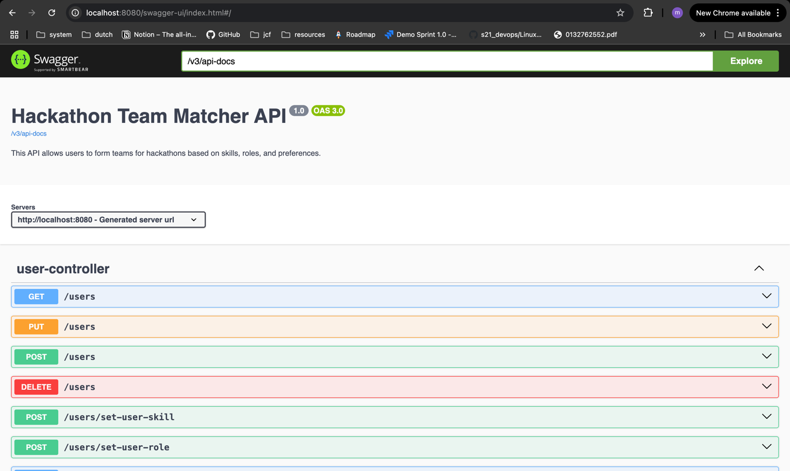

# TeamMatch Application

A Spring Boot application for managing teams, team members, and join requests. Handles JWT-based authentication and supports team creation, membership requests, and approvals.

---

### **Table of Contents**
- [Tech Stack](#tech-stack)
- [Setup](#setup)
- [Database Schema](#database-schema)
- [Entities](#entities)
- [Endpoints](#endpoints)
- [OpenApi](#openApi)
- [Test Coverage](#test-coverage)
---

### **Tech Stack**
- Java 24
- Spring Boot 3.2.4
- Spring Data JPA
- PostgreSQL
- JWT Authentication
- Maven

---

## **Setup**

1. Clone the repository:
```bash
git clone <repo-url>
cd teamMatch 
```

2. I used a cloud service for the DataBase. NeonDB is a serverless PostgreSQL provider that handles scaling, backups, and high availability automatically. It is like PostgreSQL in the cloud without the hassle of managing the database server yourself. 
Database URL, user and password are all present in the ```application.poperties``` file.
3. Build and Run
```bash
mvn clean install
mvn spring-boot:run
```

## **Database Schema**


## **Entities**

Team: id, name, description, owner, status

Users: id, name, email, roles

Roles: id, name

TeamMembers: team, user, role, approved, joinedAt

TeamRequirements: id, min_count, max_count, team, role (NOT IMPLEMENTED)

TeamJoinRequest: id, team, user, status, createdAt

## **Endpoints**

#### AUTHENTICATION AND LOGIN

1. SIGN UP  
   Route: POST /auth/signup  
   Description: Registers a new user in the system. Returns a JWT token if success.  
   Request Body Example (JSON):

```json
{
  "name": "John Doe",
  "email": "john@example.com",
  "password": "securePassword123"
}
```

Response Example (JSON)

```json
{
  "token" : "token"
}
```

2. SIGN IN  
   Route: POST /auth/signin  
   Description: Login. Returns a JWT token if success  
   Request Body Example (JSON)  

```json
{
  "email" : "email@example.com",
  "password" : "password"
}
```

Response Example (JSON)

```json
{
  "token" : "token"
}
```

#### USERS 

1. GET ALL USERS  
   Route: GET /users  
   Description: Returns all the users present in the DB. Authentication header is required.  
   Response Example (IMAGE)  


2. ADD USER  
   Route: POST /users  
   Description: Add new user. Duplicate emails are not allowed. Custom exception will be thrown.
   Request and Response Examples (IMAGE)


3. UPDATE USER  
   Route: PUT /users  
   Description: Update user info. Authentication header is required. User can edit only personal info. User Id is passed through the token and verified. In case of Ids not matching custom exception will be thrown.  
   Request and Response Examples (IMAGE)  


4. DELETE USER  
   Route: DELETE /users  
   Description: User Id is extracted from the Authentication header and used to delete user. User cannot delete each other. Custom exception will be thrown in case of Ids not matching. On delete cascade.  
   Request and Response Examples (IMAGE)


5. GET USER BY EMAIL  
   Route: GET /users?find-by-email?email=maftuna@gmail.com  
   Description: Retrieves a user by their email address. Returns a UserDto object. Returns Custom 404 Not Found Exception if no user exists with the given email.  
   Request and Response Examples (IMAGE)


6. GET USER BY NAME  
   Route: GET /users?find-by-name?name={name}  
   Description: Retrieves a user by their name. Returns Custom 404 Not Found Exception if no user exists with the given name. Returns array of all the users if there are multiple users with the same name.   
   Request and Response Examples (IMAGE)


7. GET USER ROLES
   Route: GET /users/get-user-roles?userId={userId}  
   Description: Returns a list of role titles assigned to the user. Returns empty array if there are no roles.  
   Request and Response Example  


8. ASSIGN ROLE/ROLES TO THE USER  
   Route: POST /users/set-user-role  
   Description: Users can not set roles to each other. User Id extracted from Authentication header and the role from RequestBody assigned to the user with the Id from token.  
   Request and Response Example  


9. DELETE USER ROLE  
   Route: DELETE /users/delete-user-role
   Description: Delete user role. Users cannot delete roles of each other. Auth header is required.  
   Request and Response Example


10. GET USER SKILLS/ ASSIGN SKILL/SKILLS TO THE USER / DELETE USER SKILL ROUTES WORK THE SAME WAY WITH A REPLACEMENT OF ROLE KEYWORD TO SKILL IN THE ROUTE.  

#### ROLES AND SKILLS CREATE-UPDATE-DELETE

1. ADD NEW ROLE  
   Route: POST /roles/add  
   Description: Any user can create a new role. Duplicate roles are not allowed. Custom exception will be thrown.  
   Request and Response Example  


2. UPDATE ROLE TITLE  
   Route: PUT /roles/update
   Description: Update role title. Accepts Old Title and a New Title from the RequestBody.  
   Request and Response Example  


3. DELETE ROLE 
   Route: DELETE /roles/remove
   Description: Accepts role title as Request Body, looks up from db and deletes. 
   Request and Response Example  

Before: 
Delete: 
After delete: 

4. CREATE-UPDATE-DELETE SKILLS ROUTES HANDLED THE SAME WAY.

#### TEAM ENDPOINTS

1. CREATE TEAM  
   Route: POST /teams  
   Description: Create a new team. Auth header is required. Id from the token is set as Team Owner Id. 
   Request and Response Example


DB View:


Create new team.


DB View after:


2. REMOVE TEAM  
   Route: DELETE /teams/{teamId}
   Description: Only team owner can delete the team. Auth header required. In case of mismatch Ids custom exception is thrown. On delete Cascade.  
   Request and Response Example


3. FIND TEAM BY STATUS (OPEN, FULL, CLOSED)  
   Route: GET /teams/status/{status}  
   Description: Returns array of the teams based on the requested status  
   Request and Response Example  


#### TEAM MEMBERS ENDPOINTS

1. GET MEMBERS OF THE TEAM  
   Route: GET /teams/team-members/team/{teamId}  
   Description: Returns array of the members of team. Team Id extracted from Path. Owner of team is not displayed in this method.
   Request and Response Example


2. GET TEAMS OF THE USER  
   Route: GET /teams/user/{userId}
   Description: Returns an array of the Team names a user owns or is part of.


#### TEAM JOIN REQUESTS ENDPOINTS

1. SEND A JOIN REQUEST 
   Route: POST /teams/{teamId}/requests  
   Description: Any user can send a request to join any team. User id extracted from auth header. Default join request status is "PENDING". Team owner can accept or reject the request.  
   Request and Response Example


2. VIEW REQUEST TO JOIN THE TEAM
   Route: GET /teams/view-requests/{teamId}  
   Description: Only a team owner can access this route. User Id is extracted from auth header. In case of Ids mismatch custom exception is thrown.  
   Request and Response Example


3. RESPOND TO THE JOIN REQUEST  
   Route: POST /teams/{requestId}/respond  
   Description: Team owner can respond to the join requests. Sends a Request Body with the ACCEPT or REJECT status. Custom exception is thrown in case of any mismatch.  
   Request and Response Example  


## **OpenApi**


## **Test Coverage**


